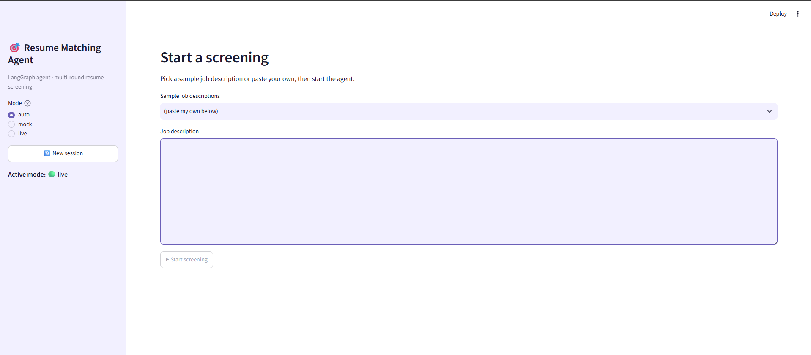
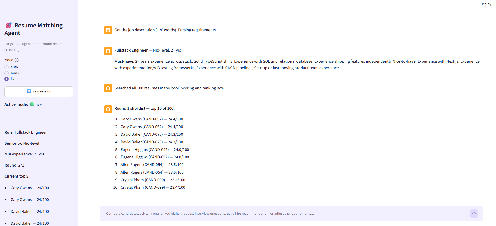
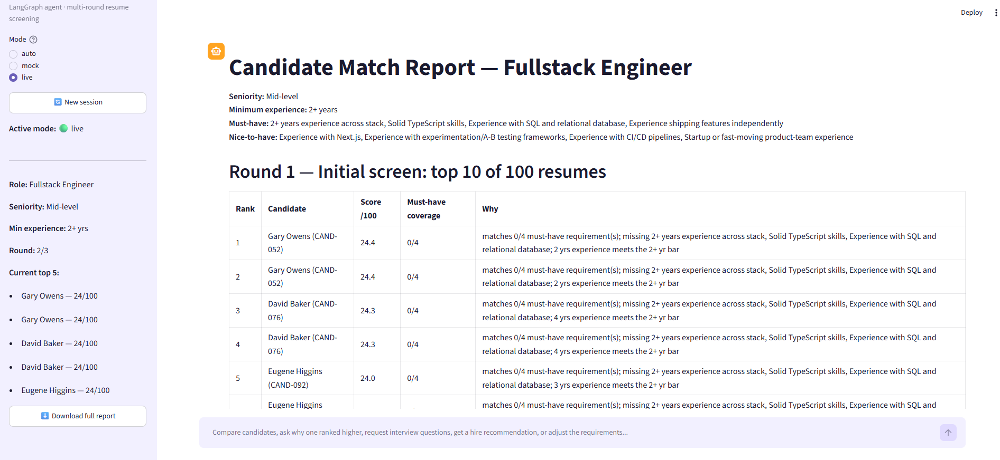
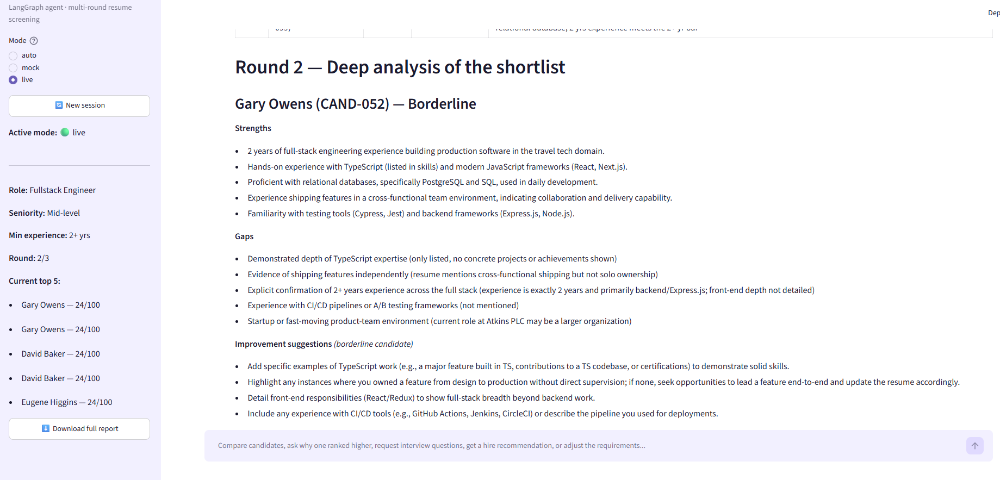
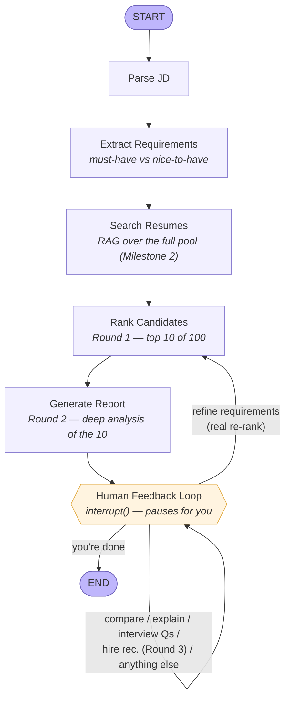

# Resume Matching Agent

A [LangGraph](https://github.com/langchain-ai/langgraph) agent that screens resumes against a job description in three rounds — initial screen, deep analysis, hire recommendation — then hands off to a conversational loop where you can compare candidates, ask why one ranked over another, request interview questions, or adjust the requirements and get a live re-rank.

Runs two ways: fully offline with a rule-based fallback (zero setup, zero API key), or with [Groq](https://console.groq.com) for real LLM reasoning + local embeddings for semantic search. Both modes are real, working implementations, not one stub and one demo — see [`docs/ARCHITECTURE.md`](docs/ARCHITECTURE.md) for why.

Built for an AI-agent-engineering course assignment (see [Assignment brief coverage](#assignment-brief-coverage) below), structured as a standalone project.

## UI
*Initial Screen Via Streamlit*



*Post Search Screen Via Streamlit*






## Demo

```bash
python matching_agent.py --jd data/job_descriptions/senior_frontend_react.txt
```

> **You:** Why did John rank higher than Jane?
>
> **Agent:** John Whitfield leads this comparison, covering 6/6 must-have requirement(s) versus Jane Okafor's 5/6. The gap comes down to TypeScript.

> **You:** We also need AWS experience
>
> **Agent:** Got it — updating the requirements and re-ranking against all 100 resumes...
>
> ## What changed since the last ranking
> - Newly in the top 10: William Warren, April Booth
> - Dropped out of the top 10: Marcus Webb, Daniel Floyd

Six full conversations like this, captured by actually running the agent, are in [`tests/test_scenarios.md`](tests/test_scenarios.md).

## Architecture



This is a hand-labeled version of the actual compiled graph — see [`diagrams/`](diagrams/) for the raw `graph.get_graph().draw_mermaid()` output and a full write-up of every design decision in [`docs/ARCHITECTURE.md`](docs/ARCHITECTURE.md).

## Features

| Area | What's implemented |
|---|---|
| **Agent state** | Conversation history, job-requirements understanding, candidate shortlist + per-candidate reasoning, all in one typed `AgentState` ([`src/state.py`](src/state.py)) |
| **Graph workflow** | The exact required shape — `Parse JD → Extract Requirements → Search Resumes → Rank Candidates → Generate Report → Human Feedback Loop → END` — with real loop-back edges, not a straight line |
| **Tools** | Milestone 1 filesystem tools, Milestone 2 RAG search, plus `extract_requirements`, `compare_candidates`, `generate_interview_questions`, `deep_analyze_candidate`, `recommend_hire_decision` (11 tools total, all LLM-callable) |
| **Conversational interface** | Natural-language queries against a real tool-calling loop (live) or keyword routing over the same tools (mock) — both handle the assignment's own example queries |
| **Iterative refinement** | Add/remove/promote requirements mid-conversation; the agent re-ranks against the already-retrieved pool and explicitly explains what changed |
| **Multi-round screening** | Round 1 (top 10 of 100) → Round 2 (deep analysis) → Round 3 (hire/no-hire, on demand per candidate) |
| **Explainability** | Every shortlist entry carries a rationale; deep analysis breaks out strengths/gaps; borderline candidates (score 55–74) get concrete improvement suggestions |
| **Interfaces** | CLI ([`matching_agent.py`](matching_agent.py)) and Streamlit ([`app_streamlit.py`](app_streamlit.py)), both driving the identical compiled graph |

## Tech stack

- **Agent framework:** LangGraph (`StateGraph`, `interrupt()`/`Command` for human-in-the-loop, `MemorySaver` checkpointer)
- **LLM (live mode):** Groq — free tier, no credit card. Defaults to `openai/gpt-oss-120b` / `openai/gpt-oss-20b`
- **Embeddings + vector store (live mode):** local HuggingFace `sentence-transformers` + Chroma — no API cost
- **Offline fallback (mock mode):** scikit-learn TF-IDF + a transparent weighted scoring formula
- **Interfaces:** Rich (CLI), Streamlit
- **Data:** 100 synthetic resumes + 3 sample job descriptions, generated by [`scripts/generate_synthetic_data.py`](scripts/generate_synthetic_data.py) (Faker-based, seeded for reproducibility)

## Setup

```bash
git clone <this-repo>
cd resume-matching-agent
pip install -r requirements.txt
```

That's it for mock mode — the dataset ships in the repo, ready to go:

```bash
python matching_agent.py --mode mock --jd data/job_descriptions/senior_frontend_react.txt
```

For live mode, get a free key at [console.groq.com/keys](https://console.groq.com/keys):

```bash
cp .env.example .env
# edit .env, add GROQ_API_KEY=...
python matching_agent.py --mode live --jd data/job_descriptions/senior_frontend_react.txt
```

Leave `--mode` off (or use `--mode auto`, the default) and it picks live automatically once `GROQ_API_KEY` is set, mock otherwise.

## Usage

**CLI** (interactive job-description picker if you skip `--jd`):

```bash
python matching_agent.py
python matching_agent.py --mode mock                                    # force offline
python matching_agent.py --jd data/job_descriptions/backend_engineer_node.txt
```

**Streamlit:**

```bash
streamlit run app_streamlit.py
```

**Regenerate the synthetic dataset** (only needed if you want a different seed/size — the repo already ships with one):

```bash
python scripts/generate_synthetic_data.py
```

**Reproduce or extend the test scenarios:**

```bash
python tests/scenario_runner.py --jd data/job_descriptions/senior_frontend_react.txt \
  --say "Compare the top 3 matches side by side" \
  --say "That's all"
```

## Project structure

```
matching_agent.py          # StateGraph wiring + CLI (the required Part-A deliverable)
app_streamlit.py           # Streamlit interface, same graph
src/
  state.py                 # AgentState schema
  config.py                # mode resolution, paths, thresholds
  llm.py                   # Groq + embeddings provider layer
  ranking.py                # round-1 scoring (shared by both modes)
  report_generator.py       # markdown report + diff rendering
  tools/
    filesystem_tools.py     # Milestone 1
    rag_tools.py             # Milestone 2
    screening_tools.py       # extract_requirements, compare_candidates,
                              # generate_interview_questions, deep_analyze_candidate,
                              # recommend_hire_decision
  graph/
    nodes.py                # every graph node, incl. the human-feedback loop
data/
  resumes/                  # 100 synthetic resumes + metadata sidecar
  job_descriptions/         # 3 sample JDs
scripts/generate_synthetic_data.py
tests/
  scenario_runner.py        # programmatic conversation driver
  test_scenarios.md         # 6 captured conversation flows
docs/
  ARCHITECTURE.md
  DEMO_SCRIPT.md
diagrams/
  state_machine.mmd         # hand-labeled diagram (used above)
  state_machine.raw.mmd     # auto-generated from the compiled graph
```

## Testing

Six real conversation flows are captured in [`tests/test_scenarios.md`](tests/test_scenarios.md) — not hand-written examples, but actual transcripts from running the agent through [`tests/scenario_runner.py`](tests/scenario_runner.py), which drives the compiled graph the same way the CLI does. They cover: a full round-1→3 walkthrough, default-candidate shorthand, deep analysis + hire calls, sequential requirement refinements, the generic help fallback, and direct candidate-ID references.

## Assignment brief coverage

Part A (agent state, required graph shape, all required tools) · Part B (conversational interface matching the brief's own example queries, iterative refinement with explained re-ranks) · Part C (three-round screening, explainability with borderline-candidate suggestions) are all covered — see the [Features](#features) table above and [`docs/ARCHITECTURE.md`](docs/ARCHITECTURE.md) for exactly how each requirement maps to code. Submission deliverables: this README + diagrams double as the state-machine diagram, both interfaces are included, `tests/test_scenarios.md` covers the 5+ conversation flows, and [`docs/DEMO_SCRIPT.md`](docs/DEMO_SCRIPT.md) is a shot-by-shot script for the walkthrough video.

## License

[MIT](LICENSE)
